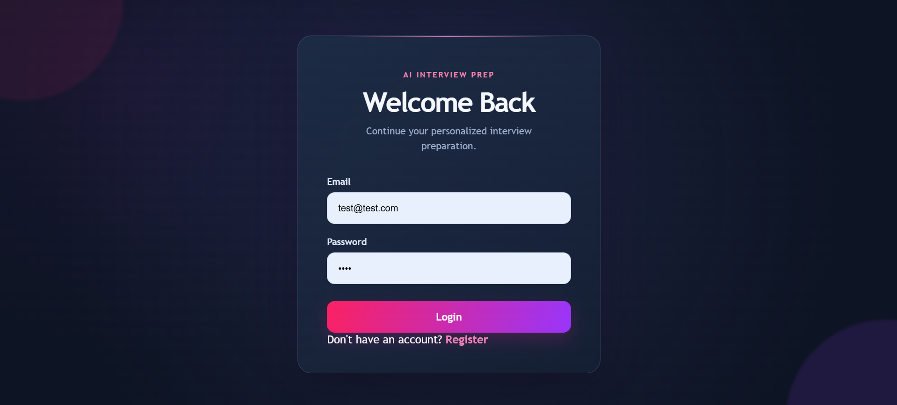
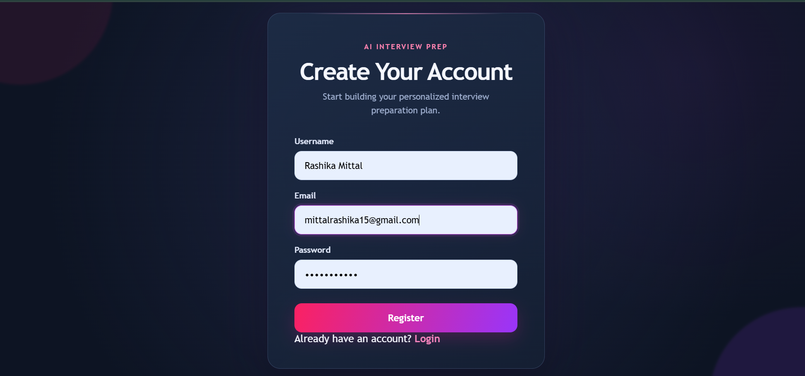
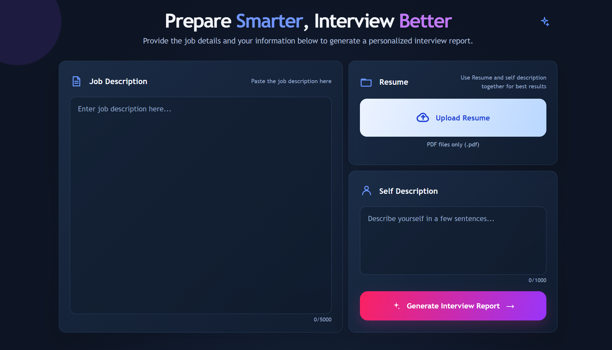
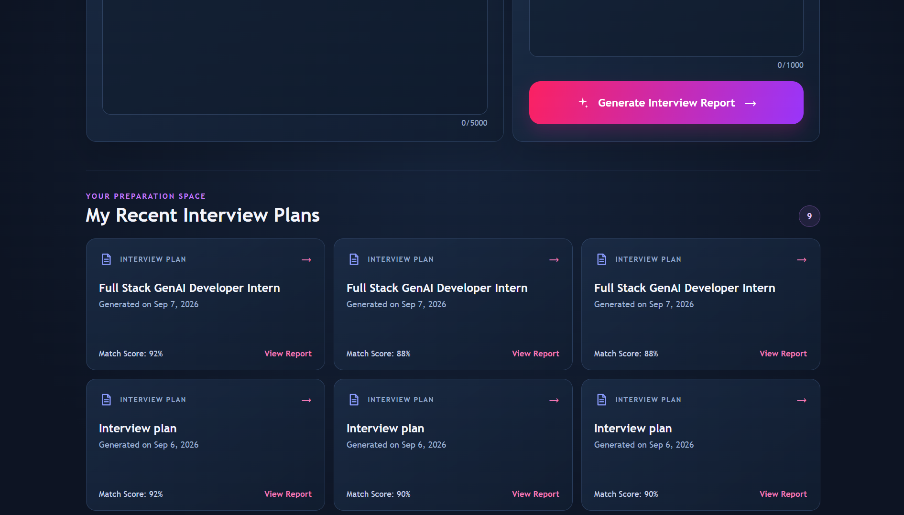
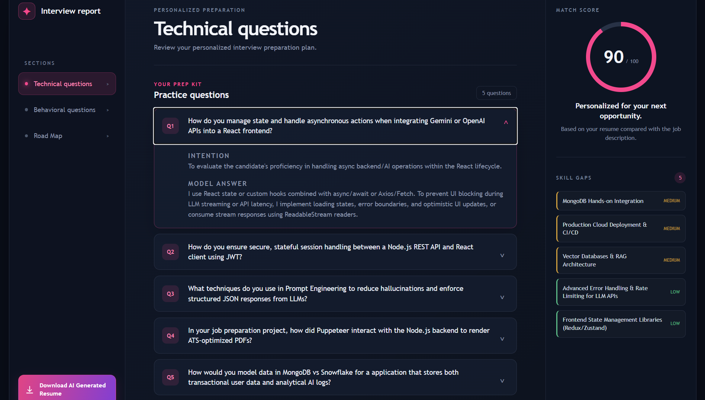
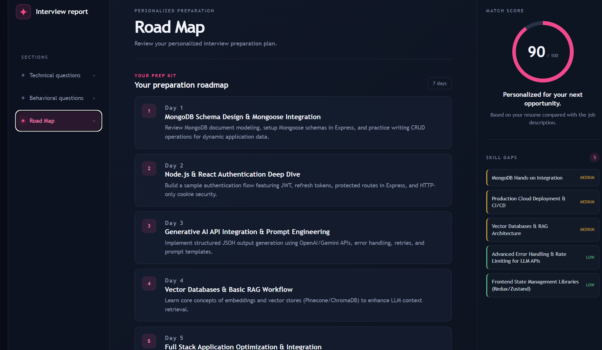
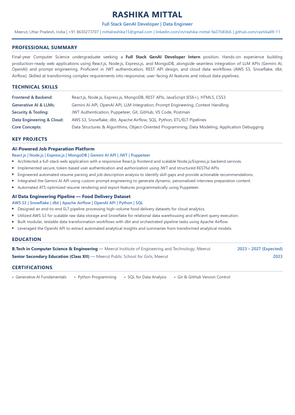

# AI Resume Optimization & Interview Preparation Platform

An AI-powered full-stack web application that helps candidates analyze their resumes against job descriptions, identify skill gaps, generate personalized interview preparation plans, and create AI-optimized resumes.

## Overview

The AI Resume Optimization & Interview Preparation Platform is designed to simulate a real-world recruitment preparation product.

Users can:

- Create an account and securely log in
- Upload their resume in PDF format
- Provide a target job description
- Add a personal/self description
- Analyze their profile using Generative AI
- Get a job match score
- Identify missing or weak skills
- Generate personalized technical interview questions
- Generate behavioral interview questions
- Receive model answers and interviewer intentions
- Get a 7-day interview preparation roadmap
- Save and revisit previous interview reports
- Generate and download an AI-powered resume as a PDF

---

## Features

### Authentication

- User registration and login
- JWT-based authentication
- HTTP cookie-based token storage
- Protected routes
- Persistent authentication state
- Secure user-specific report access

### AI-Powered Resume & Job Analysis

The application uses the Google Gemini API to analyze:

- Resume content
- Job description
- Candidate self-description

It generates:

- Job title
- Match score
- Skill-gap analysis
- Technical interview questions
- Behavioral interview questions
- Model answers
- Interviewer intentions
- Personalized preparation roadmap

### Interview Preparation

Each generated report includes:

#### Technical Questions

Role-specific technical questions based on the candidate's resume and target job.

#### Behavioral Questions

Behavioral interview questions designed around the candidate's profile and target role.

#### Skill Gap Analysis

Missing skills are identified and classified by severity:

- Low
- Medium
- High

#### 7-Day Preparation Roadmap

A personalized preparation plan containing:

- Day
- Focus area
- Recommended task

### Interview History

Users can view their previously generated interview plans from the Home page.

Each report displays information such as:

- Job title
- Match score
- Generated date

Users can click any previous report to reopen the complete interview analysis.

### AI-Generated Resume

Users can generate an AI-powered resume based on the selected interview report.

The generated resume can be downloaded directly as a PDF.

---

## Tech Stack

### Frontend

- React.js
- React Router
- Axios
- SCSS
- Vite

### Backend

- Node.js
- Express.js
- MongoDB
- Mongoose
- JWT
- Cookie Parser
- Multer
- PDF parsing

### Generative AI

- Google Gemini API
- Structured AI output
- Zod schema validation
- Prompt engineering

### PDF Generation

- Puppeteer
- PDF parsing

### Development Tools

- Git
- GitHub
- VS Code
- Postman

---

## Application Architecture

```text
                    ┌──────────────────────┐
                    │       React UI       │
                    │       Frontend       │
                    └──────────┬───────────┘
                               │
                               │ Axios / REST API
                               ▼
                    ┌──────────────────────┐
                    │    Express Server    │
                    │       Backend        │
                    └──────────┬───────────┘
                               │
              ┌────────────────┼────────────────┐
              │                │                │
              ▼                ▼                ▼
        ┌───────────┐   ┌─────────────┐   ┌────────────┐
        │ MongoDB   │   │ Gemini API  │   │ PDF Tools  │
        │ Database  │   │   GenAI     │   │ Parse/     │
        │           │   │             │   │ Generate   │
        └───────────┘   └─────────────┘   └────────────┘


# User Flow

Register / Login
       │
       ▼
Upload Resume
       │
       ▼
Enter Job Description
       │
       ▼
Enter Self Description
       │
       ▼
Generate Interview Report
       │
       ▼
AI Analysis
       │
       ├── Match Score
       ├── Technical Questions
       ├── Behavioral Questions
       ├── Skill Gaps
       └── 7-Day Preparation Plan
       │
       ▼
Save Interview Report
       │
       ▼
View Previous Reports
       │
       ▼
Generate AI Resume
       │
       ▼
Download Resume PDF


#  Project Structure
AI_Resume_Optimization_Platform/
│
├── Backend/
│   ├── src/
│   │   ├── config/
│   │   ├── controllers/
│   │   │   └── interview.controller.js
│   │   ├── middleware/
│   │   │   ├── auth.middleware.js
│   │   │   └── file.middleware.js
│   │   ├── models/
│   │   │   └── interviewReport.Model.js
│   │   ├── routes/
│   │   │   ├── auth.route.js
│   │   │   └── interview.routes.js
│   │   └── services/
│   │       └── ai.service.js
│   │
│   ├── server.js
│   ├── package.json
│   └── .env
│
├── Frontend/
│   ├── src/
│   │   ├── features/
│   │   │   ├── auth/
│   │   │   └── interview/
│   │   ├── App.jsx
│   │   ├── app.routes.jsx
│   │   ├── main.jsx
│   │   └── index.css
│   │
│   ├── package.json
│   └── vite.config.js
│
└── README.md


## Screenshots

### Login



### Register



### Home Dashboard



### Interview History



### Interview Report



### 7-Day Preparation Roadmap



### AI Generated Resume

